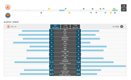

# 大数据可视化相关公司

## 创冰科技

### 官方介绍

上海创冰信息科技有限公司是一家专注于体育赛事分析的高科技公司。研发团队自2003年开始致力于足球及篮球赛事分析系统的研发及服务，公司汇集了相关领域博士、硕士等专业人才，是一家集产品研发，数据采集和分析为一体的体育互联网高新技术企业。公司座落于上海市的体育科技产业园。

上海创冰秉持"科技服务于体育"的宗旨，孜孜不倦地为职业球队、广大球迷、足彩彩民提供专业的数据分析服务，公司所研发产品均以此理念为指导思想。不断提高产品的满意度和专业度，是我们不断追求卓越的动力源泉。

http://www.champdas.com/

###分析
从网站上看，该公司从2004年起，以一款单机版足球相关的系统开始，进入足球领域，持续多年为各个俱乐部、媒体提供足球相关的数据。公司以足球相关数据采集起家，比较专业，目前在逐渐切入数据的分析、可视化等技术领域。但从网站提供的案例分析，其高级的数据分析与可视化的工作才刚开始，还有很长的路要走。

