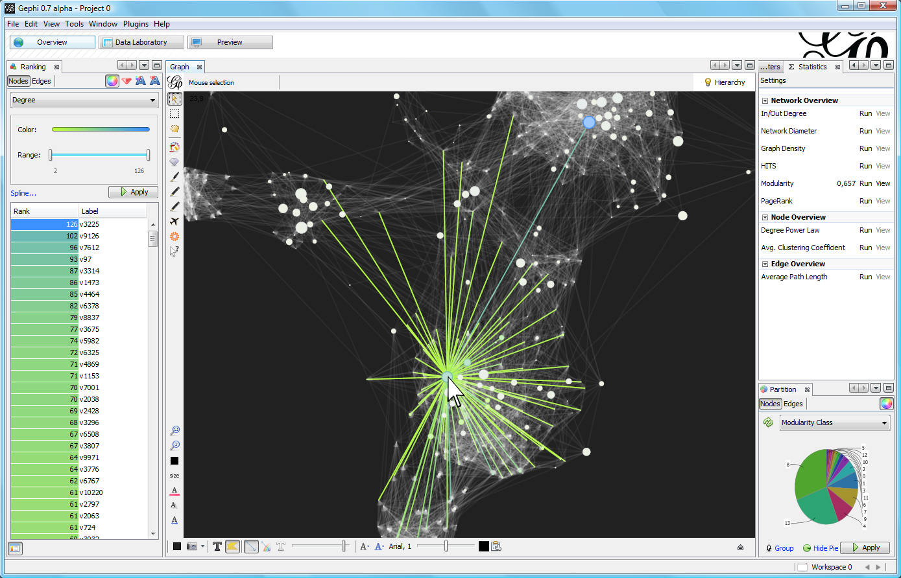
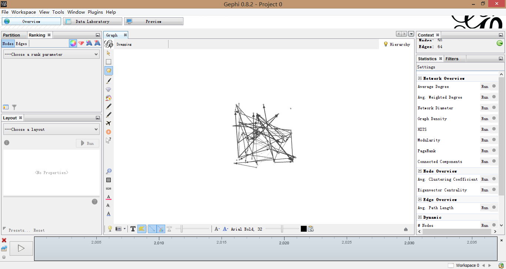
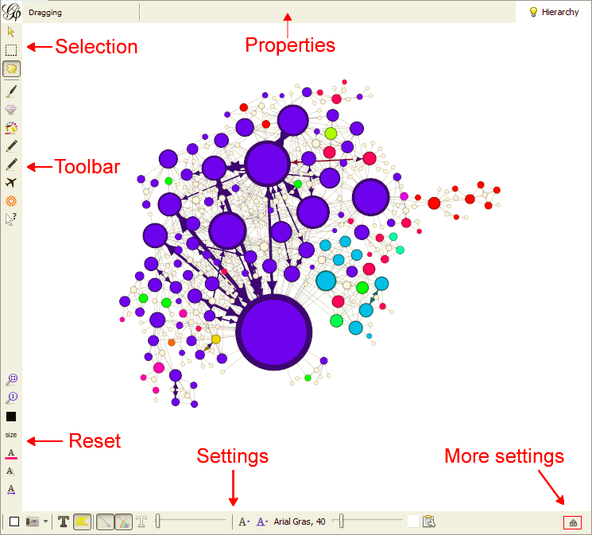
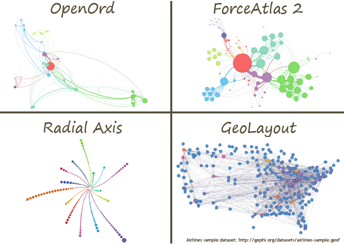
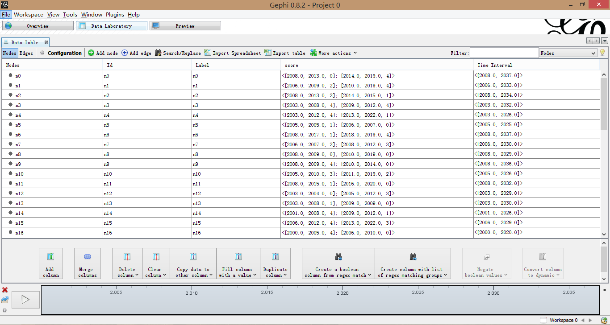
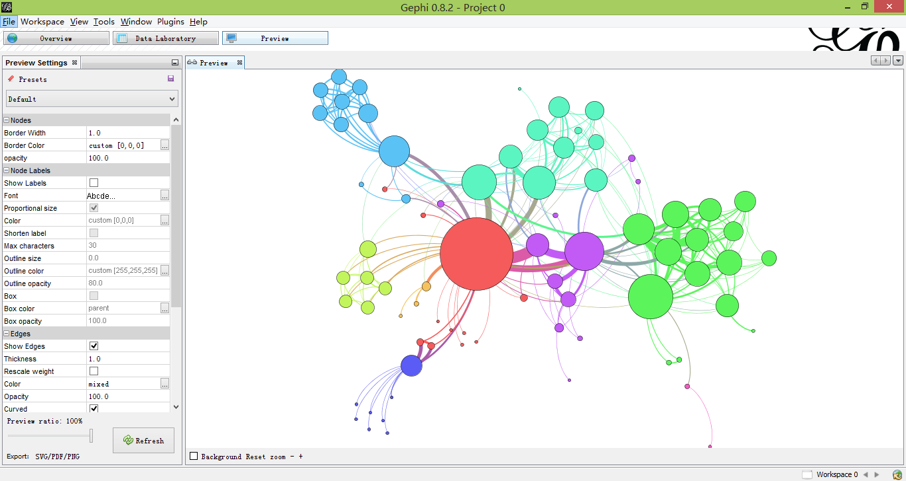
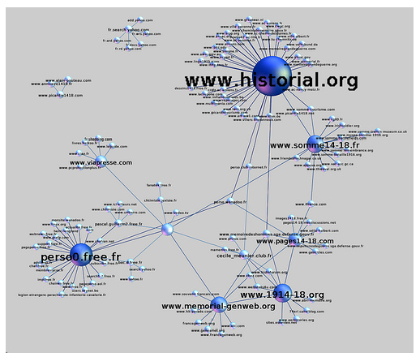
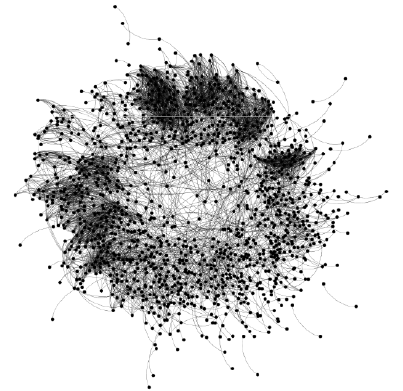
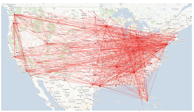

# 图可视化领域的photoshop:Gephi

**关键词：** 网络可视化 图 信息可视化 

## 前言

这篇文章的作者于2010年前后，参与了Gephi软件相关插件的开发，期间与Gephi的核心开发人员进行了深入细致的沟通。一篇短文不能够详细介绍Gephi的各个部分，本文对Gephi的核心功能进行介绍。

## Gephi是什么?
Gephi是一款网络可视化的软件，目标是打造“图领域的Photoshop”。该软件使用Java开发，可以支持多种不同的网络数据格式，可以运行在Windows, Mac OS X及Linux系统上。更为可贵的是，该软件基于GPL v3协议开放源代码，并且有一个活跃的核心团队一直在对Gephi进行维护与开发。除此之外，Gephi还是一个可扩展的软件，可以基于Gephi开发各种插件，用来丰富Gephi的功能。近期推出的Gephi Toolkit则是将Gephi软件的核心模块进行了提取，使得第三方开发者不仅可以为Gephi开发插件，还能够在自己的Java程序中，使用Gephi的数据结构、布局、统计分析、渲染等核心模块。

## 用户界面
下面给出了Gephi的用户界面，整个界面由三个大的部分组成，分别是可视化操纵视图、原始数据视图、预览视图。我们稍微详细介绍这三个部分。
### 可视化操纵视图
下图是可视化操纵视图(Oerview)，是Gephi的最主要的视图。在该部分中，包括分类、排序、布局、主视图、统计与分析、时间轴等部分。通过这些功能的组合，可以实现对Graph的丰富的操作。

 
 
下面是主视图的介绍，可以通过所见即所得的方式，实现图形的选择、属性设置、文本设置等多种设置。

布局是图可视化中的重要组成部分。Gephi包括了丰富的布局算法。下面是Gephi中的几种布局算法的图。

### 原始数据视图
原始数据视图支持对原始数据的修改，数据的导入、导出等功能。

 
 

###预览视图
预览视图支持对最终可视化的展示与微调，支持图片、pdf文件等的输出。

 

## 一些demo
网络关系

生物学网络

美国航空线路图

