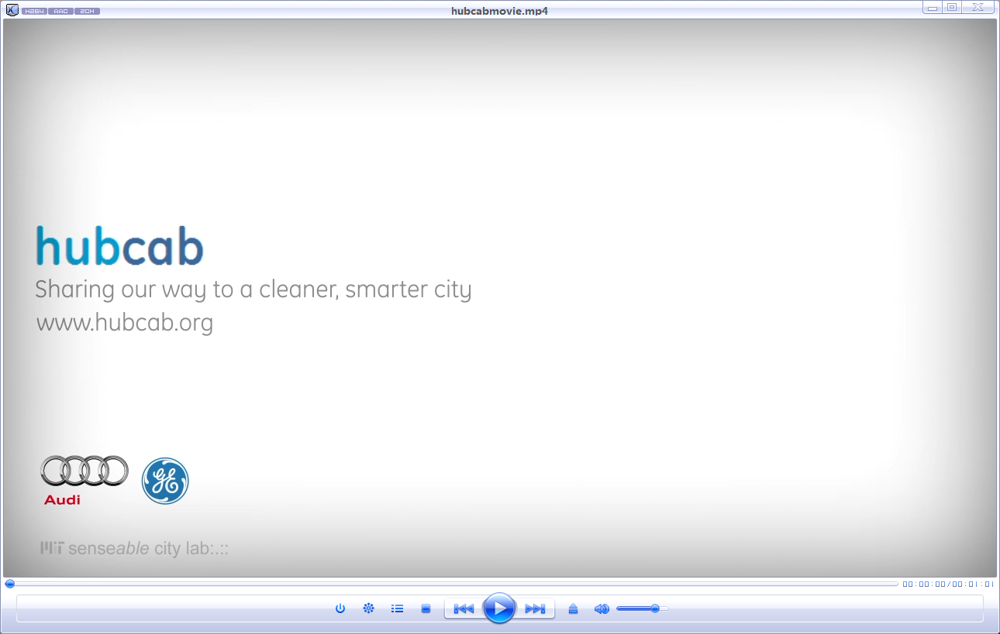
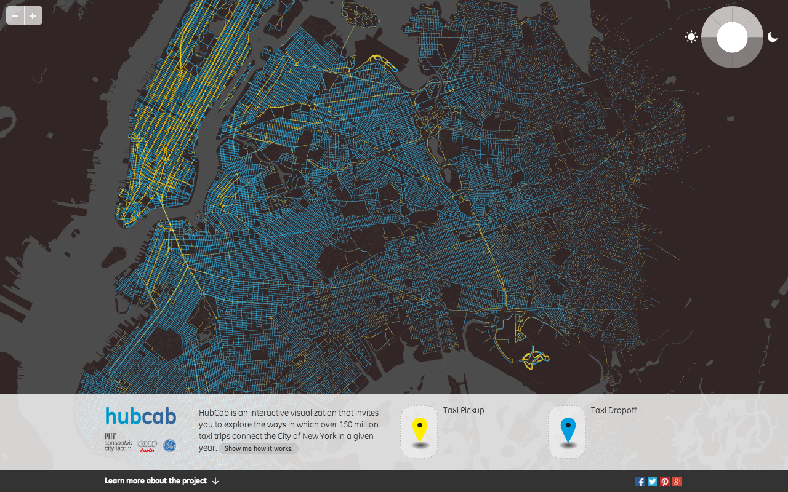
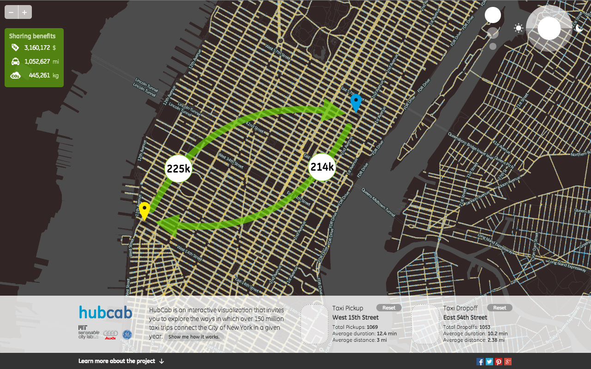
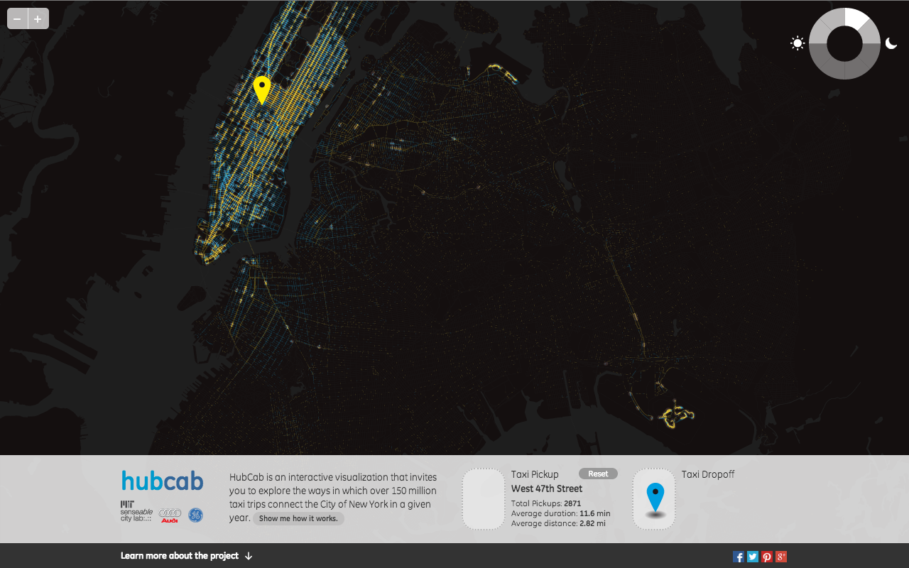
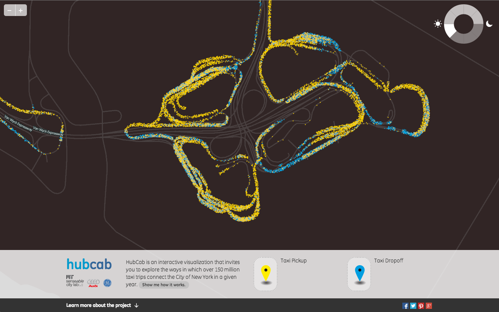
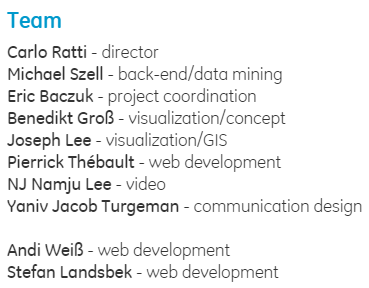

今天跟大家分享的，是MIT感知实验室与奥迪公司、通用电气合作的，旨在缓解交通拥堵的项目，以及项目中的可视化系统。

##概述
这是MIT感知实验室实验室与奥迪公司、通用电气合作的一项目，名为HubCab，该项目以减缓交通拥堵为最终目标，设计相关的工具与模型来达成该目标。

MIT的专家认为，HubCab项目不仅要能够节省人们的金钱与时间，还可以让人们为自己的出行进行更好的规划，从而降低40%的出行线路(trips)。通过研究，专家给出了相关的共享模型，就是最近大热的“拼车”，通过模型给出更好的拼车建议，相关的模型能够估算出总共节约的车费、路程等。我们首先来看一下宣传视频：

一如MIT感知实验室一贯的作风，结果也是要好好展示一番的。他们针对该数据及相关研究成果，设计出一个可视化系统。该系统将1.7亿条的载客线路数据进行了快速的可视化，使用者可以通过交互，快速的发现一些模式。

首先，所有的数据被呈现在地图上，使用者可以通过放缩，来观察总体情况或某个区域的细节，每放大一次，均会有更加详细的数据被呈现出来。下面这张图，显示了纽约市一年中1.7亿条出租车线路中的上车与下车点。

该系统还提供了一些继续分析的功能，使用者可以选择地图中的两个点作为起始点，系统会将所有起始点在选中点一定距离内的线路数目计算出来，并且，还会显示出如果使用了合理的拼车模型，最终节约的车费、路程以及少释放的二氧化碳的量。下图则显示了曼哈顿街区的两个点之间的数据。

除此之外，使用者还可以通过选择右上角的时间圆盘，来找到自己感兴趣的时间段进行观察与分析。下图显示了所有以曼哈顿街区为起点，在中午12点至下午三点的时间里，出租车的目的地的分布情况。

而下图则显示了LFK机场在凌晨三点至六点之间的所有的上车与下车的情况。

##技术开发
该项目的基础数据是纽约市13500辆出租车在2011年总计达1.7亿条的出租车载客线路数据。在这些数据中包含了所有的上车与下车点，以及对应的时间。

地图数据来自OpenStreetMap并进行了处理，将街道处理成20万段小的片段，每个片段约40米长，并将数据存入MongoDB数据库中。

所使用的技术与工具包括：
+ MongoDB用来进行街区与出租车数据的存储与快速检索
+ OpenStreetMap用来提供基础地图
+ MapBox用来实现地图的一些可视化效果
+ Python用来进行一些数据处理的工作
+ Javascript用来支持系统前端开发的主要语言
+ PHP用来支持系统服务器端开发的主要语言
+ JSONP实现前后端交互的跨域请求的库

##多说一点
对于该项目，我看到最后，最大的体会是在“Team”一栏的介绍。从这个介绍中，我们能够发现开发一个好的可视化系统，需要一个什么样的团队来支持。我们看到HubCab项目中包含:
+ 一名项目负责人
+ 一名项目协调，辅助项目负责人，协调与合作方及组内的事务
+ 一名后台开发及数据挖掘工程师，负责数据处理、存储、挖掘等工作
+ 一名负责可视化的概念设计
+ 一名负责GIS(地理信息系统)相关的可视化
+ 三名Web开发工程师
+ 一名视频制作
+ 一名传媒设计(Communication design)

__如果要设计成这样的可视化，需要多个不同领域的专家协作完成__

##[访问地址](http://hubcab.org/)
