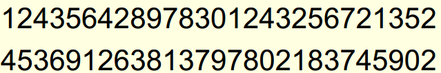
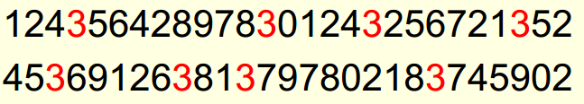
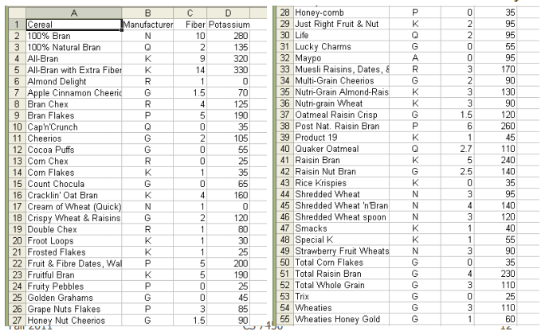
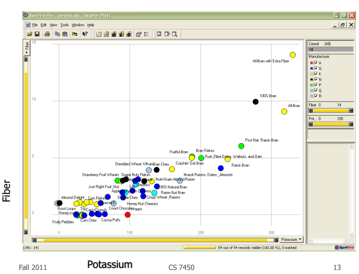
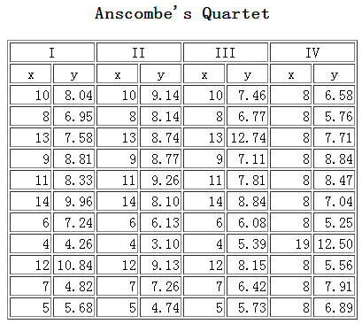
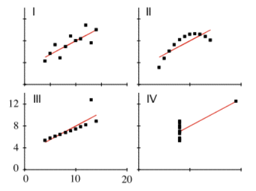

一句话回答：可视化能够提高效率，如果如果没有可视化，我们的决策就会低效，这会导致金钱、时间的损失，甚至危及健康与生命。

###1. 一个几乎被用烂的例子，找到下面图中的3的数目

如果用一点可视化的方法，添加颜色映射，是不是省时又省力?

###2. 看下面一张表，介绍了各个工厂小麦(Cereal)的元素含量。你能否回答这些问题，看花了多长时间。
.那种小麦钾(potassium)含量更高?
.钾(potassium)和纤维(fiber)之间是否有什么关系?如果有，哪些品种的小麦不符合这种关系?
.那家工厂(manufacturer)生产最健康的小麦?

然后，看下面的这张图，他们表示了相同的信息量，回答同样的问题，你花了多长时间?

###3. 下面的四条数据集(I,II,III,IV)，告诉我他有什么区别？

你会发现，虽然他们感觉不同，但你计算一下发现，他们好像是一样的：
.x平均值均为9.0
.y的平均值均为7.5
.最小二乘回归方程都是y=3+0.5x
.平方误差的和均为110.0
.regression sums of squared errors (variance accounted for by x) = 27.5
.residual sums of squared errors (about the regression line) = 13.75
.correlation coefficient = 0.82
.coefficient of determination = 0.67
然后我们给出他们的图，一目了然
	

接下来，我们看一看可视化在哪些地方帮到了我们。

做可视化的人，下面很多图都看过，我尝试对这些内容从不同的角度组织一下，各位轻拍。

这一部分中，我们打乱可视化的三个方向，从应用领域角度，看看可视化在哪些地方帮到了我们，或很可能会帮到我们。

###1. 医疗与卫生
####找到(验证)霍乱的发生与传播
这幅可视化作品是由一名流行病学家John Snow创作的，他是一名伟大的流行病学家。为了研究霍乱的传播，他于1854年创作的伦敦某个区域霍乱发生与水井的关系图。在图中，标出了水井，并且用横线标出了霍乱发生的人数。通过该可视化，直观且有力的证实了霍乱的传播与水井的关系，封住特定的水井，霍乱的传播明显减弱。

####证明了公共卫生与存活率的关系
现代护士之母——蓝丁格尔(Florence Nightingale)，是克里米亚战争期间的一名护士，她通过在报告中使用的新的可视化的形式，有力的证明了公共卫生条件在存活率上的重要作用，并成功说服了议会就此展开了进一步调查。
在图中，蓝色部分半径代表了传染病和其它疾病的死亡人数，红色代表了受伤的死亡人数，黑色代表了其它的死亡人数。可以直观看出，非战斗死亡人数的比例很大，间接说明了公共卫生条件对战场存活率的作用。

####辅助诊断
没有CT，大夫就没法给病人诊断，严重后果就是没查出病因病人挂了。

###2. 交通
####对普通用户：实时路况报告
印象最深的，就是师姐下班前，经常一边跟我们聊天，一边刷新交通委的实时路况，在交通稍微畅通些时，再动身出发。这是交管局的实时路况播报的结果和路牌，通过最直接的颜色映射，以可视化的方式呈现拥堵情况，减小了堵在路上的几率。

####对管理者：实时监测、优化道路及交通、交通管制等
在今年举办的第一届可视分析大会(ChinaVA)上，有幸听了北京市交通信息中心王立勋老师的报告，三个感触，第一是交通数据是真正的多源异构大数据，第二是可视化在目前的交通监控、数据分析上发挥了重要作用，第三是还有很多事要做。分享其中的两张ppt。

下面再给几张看上去很“炫”的交通数据可视化与可视分析的图。

###3. 工业生产
####鱼骨图帮助提高效率，分析因果
鱼骨图由日本管理大师石川馨先生所发明，故又名石川图。鱼骨图是一种发现问题“根本原因”的方法，它也可以称之为“Ishikawa”或者“因果图”。这是管理学大师将可视化加入管理学思想的结果。

####监控生产
通过可视化的方式，可以实时监控各个生产环节的情况。不仅能够通过直观的方式对生产情况概况进行了解，对于生产过程中的异常，也能够及时的发现，提高了效率。

###4. 反恐
####少数派报告
少数派报告中的情节。影片展现了未来先进的预防犯罪的手段，来事前得到犯罪信息，借以根除犯罪。在预防犯罪的小组里，领导约翰-安德顿(Chief John Anderton，汤姆-克鲁斯饰)的工作是最卖力的。。。
在这个预测犯罪的场景中，使用了各种可视化、交互及分析的方法，这也是可视分析提出的一个终极目的：通过可视化的方式分析各种多源异构的数据，最终实现对恐怖行为的预测和防范。
这，就在不远的将来。

####钢铁侠

###5. 信息传播
目前可视化在这个角度发挥的作用最为公众所熟知，我们举几个例子：
####拿破仑东征
1812年拿破仑进攻俄国的情况，笔文字描述要直观很多吧。

#### 1864年法国红酒的出口情况

#### 美国2010年中期大选与2008年大选各区域民意的变化

#### H7N9禽流感发病情况

####用户在一段时间，将他们的SUV卖掉，转手买了一辆更小的车。用户在品牌和车辆容量上是如何选择的，这幅图以可视化的方式给了答案

6.财经、文化、民生、军事等等其它方面，就不再一一举例了。这方面的内容，可以参考涂子沛先生的《数据之巅》上关于数据可视化的内容。包括美国LEHD项目、林正祥先生基于地图的可视化等等。
