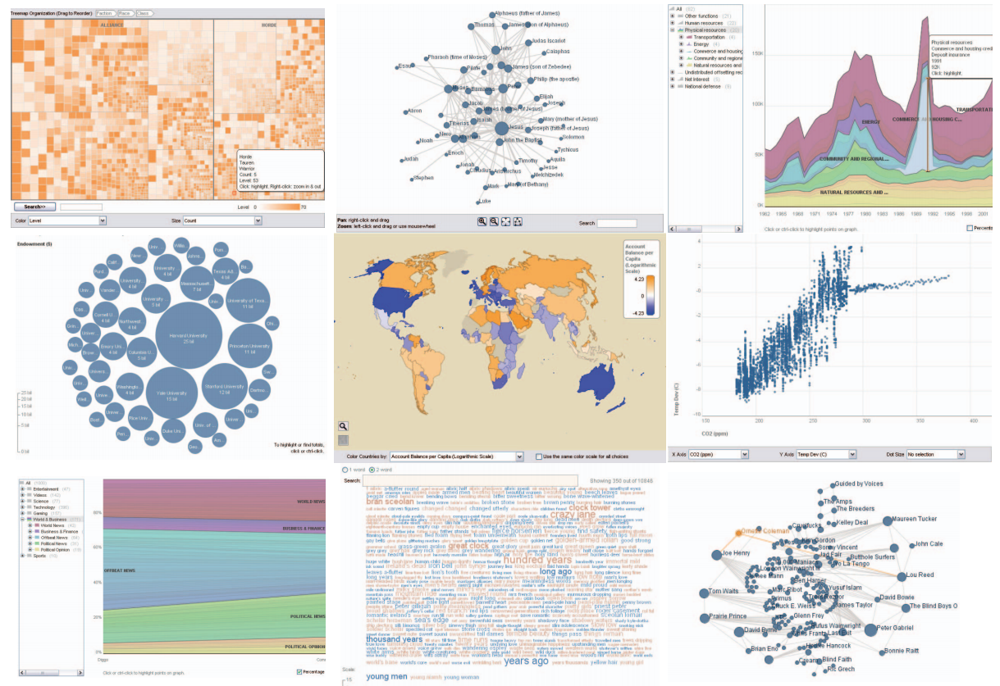

## 简介
ManyEyes是一款在线的可视化工具，用户可以自己上传数据，选择合适的可视化展示。这款工具来自IBM研究院的Visual Communication Lab，作者是Martin Wattenberg和Fernanda Viégas。这个项目的初衷是希望能普及可视化，让人人都能把自己感兴趣的数据生成漂亮的图表。自从06年发布以来，受到了可视化学术界和大众媒体的广泛关注。每天都有很多人在ManyEyes的网站上生成发布他们自己的可视化，并进行互动交流。它是向大众普及可视化的一个非常成功的案例。

## 版本演进
ManyEyes目前有两个大的版本的变化，第一版本发布自2006年，第二版本发布自2013年。两个版本的差别，除了在网站界面上的变化外，还增加了一些新的可视化方式。下图分别是2006年与2013年两个版本的截图。

两个版本的访问地址：
* http://www-958.ibm.com/software/analytics/manyeyes/
* http://www-958.ibm.com/software/analytics/labs/manyeyes/

## 核心特性
ManyEyes包括三个核心特性：自定制数据、丰富的可视化、一定的协同与分享。

### 自定制数据
用户既可以使用网站提供的数据去探索可视化的魅力，还可以自行上传数据。其对数据格式进行了规定。http://www-958.ibm.com/software/analytics/manyeyes/page/Data_Format.html
### 丰富的可视化
包括了柱状图、气泡图、热图、地图等等丰富的可视化。下图是两个版本支持的可视化类型。

### 一定的协同与分享
支持对可视化的评论，新版本还支持将制作的可视化进行分享。

## 使用步骤
我们以2013版为例，演示如何使用ManyEyes创建可视化
### 上传数据或选择
选择“Upload your own Data”(上传自己的数据)或“Use Existing Data”(使用已有的数据)，进行数据的选择。我们选择“Upload your own Data”，进入数据录入页面。

### 数据录入
我们选择Spreadsheet，然后把一款数据(纳斯达克股票数据)录入，然后为不同的列设置类型(文本型、数值型、日期型)，然后点击“Upload Data”(上传数据)，稍等片刻。进入可视化设置。

### 可视化设置
界面如下，可以选择各种不同的可视化类型，在这里，选择“Line Graph”(折线图)。

自行配置折线图的各个轴，然后发布。http://www-958.ibm.com/software/analytics/labs/manyeyes/#vis=503230， 这就是我们刚刚发布的可视化。可以交互的哟！

## 一些使用ManyEyes制作的可视化

## 网络相关资源
* Many Eyes：人人都能可视化 http://www.guokr.com/post/82137/
* IBM图示工具Many Eyes简介 http://blog.sina.com.cn/s/blog_651a9e980101g6sy.html
* 论文 http://ieeexplore.ieee.org/xpls/abs_all.jsp?arnumber=4376131