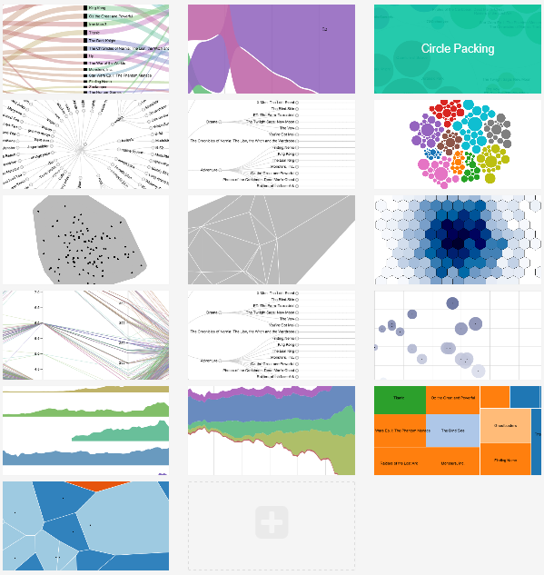

今天介绍一款小工具RAW，和之前介绍的ManyEyes很类似，我们后续会有关于类似工具的共性的总结。

## RAW概述
这是一款辅助开发可视化的小工具，它能够支持用户自定义数据，多种不同的可视化类型，并能够支持将可视化结果导出为图片。

RAW与其他辅助可视化设计的工具最大的不同在两点：
* 第一，它支持的可视化类型以适用于层次数据、网络数据、多维数据的可视化为主。它支持的类型包括各种树形图的变形、Treemap(树图)、嵌套圆、平行坐标、散点图、StreamMap(流图)。并不支持折线图、饼图等一些传统的统计图。
* 第二，它开放源代码，而且这个小工具提供了开发新的可视化组件的接口。在[这个网页上](https://github.com/densitydesign/raw/wiki/Adding-New-Charts) ，提供了如何开发新的可视化接口的步骤。

## 使用(Step by step)
###1.导入数据
RAW支持CSV数据，可以将CSV文本直接复制到文本框中，如果你想试用一下，可以选择“Insert your data”后面的下拉列表，选择一个测试数据。下面是数据加载前后的变化。如果数据加载成功，则会显示目前数据的概况，包括导入了多少数据，数据情况等。除此之外，在文本框下面，还出现了选择可视化(“Choose a chart”)的部分。

###2.选择可视化组件
目前，RAW支持了16种各不相同的可视化组件(截至2014年9月20日)。效果如下图，对于不同的可视化组件，我们之后使用专门的主题来详细介绍他们的使用吧。总的来说，这16种效果看上去还挺不错的。点击该部分的任何一个可视化组件，会出现映射各个维度(“Map your dimension”)的部分，我们选择第一行第三个嵌套圆(“Circle packing”)。

###3.映射各个维度
映射各个维度，就是将数据的各个列与可视化组件的各个图形属性进行关联。比如，我们选择了嵌套圆，界面中显示了四个图形属性，包括层次属性、尺寸、颜色、标签等四个。我们将“电影类型->电影名”的层次结构在嵌套圆中显示。映射前后的效果如下，配置完毕后，就能够看到最终的呈现结果，进入定制可视化结果(“Customize your visualization”)部分。

###4.定制可视化结果
该部分可以对呈现的结果进行微调，如对嵌套圆，可以对图的尺寸、颜色的具体映射、是否显示标签等进行配置，效果如下。之后可以进行下载与分享(“Download”)。

###5.下载与分享
RAW支持三种类型的文件下载，可以将设计的可视化结果与数据下载为svg,png或json。并且可以直接将该结果嵌入到网页中。

## 结果
自己基于RAW制作的一些效果，很快。

