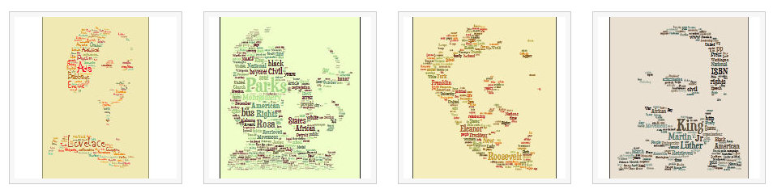
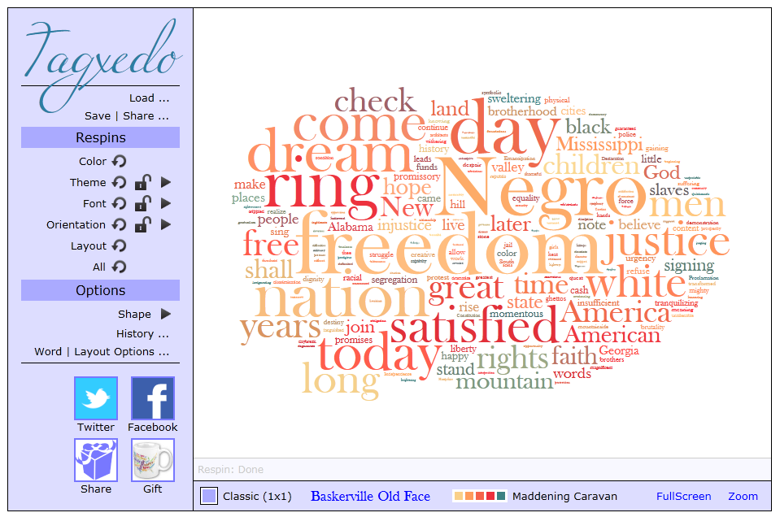
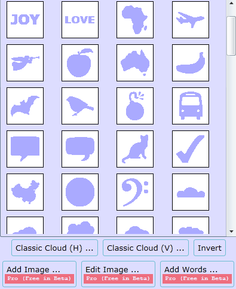
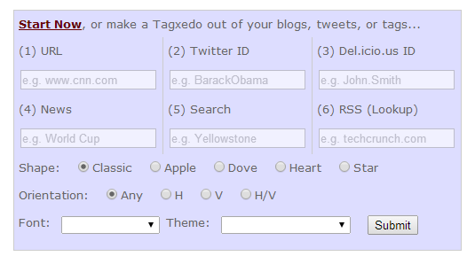
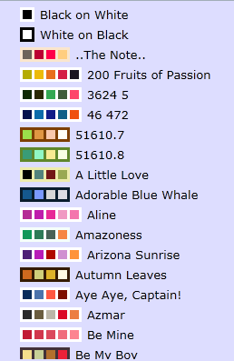
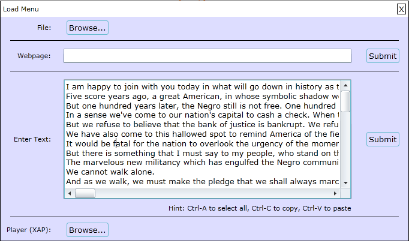
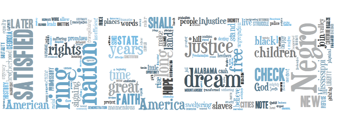
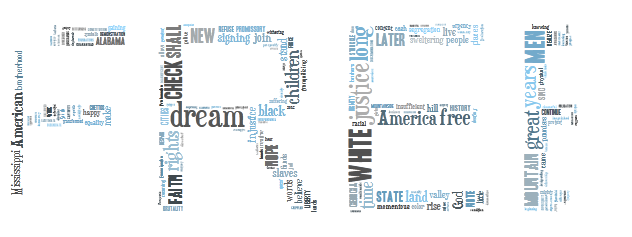

## 什么是标签云/词云
标签云/词云是文本数据可视化的一种有效方式。一般来说，标签通常是一个独立的单词，标签的重要性经常通过字体的大小与颜色进行区分。在网页导航中使用标签云，则经常是能够超链接到相应的网页中。

## Tagxedo是什么
Tagxedo能将单词(著名演讲、文章、口号，甚至是字母)转换成单词云，词云的大小由单词出现的频率来指定。
这是一个在线的服务(受益于GFW，间歇性抽风)，能够：
* 实时制作标签云
* 自定义字体、颜色、方向、形状等
* 多种选项支持微调
* 支持保存为不同分辨率的图片
* 支持标签云的缩放与拾取
* 丰富的字体及自定义的字体
* 丰富的预定义形状

##界面
下图是Tagxedo的操作界面，左侧是功能选项，右侧是生成的标签云的视图。功能自上而下分别是：
* 加载：支持文件、网页、纯文本的加载
* 保存与分享：支持图片、网页嵌入、直接打印等功能
* 颜色：支持多种不同的颜色搭配
* 风格模板：支持丰富的风格模板
* 字体：支持本地字体及预定义字体
* 方向：支持横向、纵向、混合等多种排列方向
* 布局：根据选项重新布局标签
* 形状：支持上传图片作为形状，或者使用系统自带的形状
* 单词及布局选项：一些高级选项

这是一些功能界面，包括形状选择、风格选择等。

## 一个例子
我们找到“I have a dream”的原文，来制作标签云。

加载文本。在文本框中输入原文，然后点击“Submit”，出现随机布局的标签云。

随机设置一些选项，出现不同的结果。给大家看一些结果。

这是传统的横排的标签云

这是使用文字形状(FREE制作的标签云)

我们找了一张马丁路德金的照片，这是使用马丁路德金的照片制作的标签云。

参考资源：
标签云的维基百科：http://en.wikipedia.org/wiki/Tag_cloud
沈浩老师的博客，对使用本工具制作中文标签云有介绍：http://shenhaolaoshi.blog.sohu.com/259781474.html
另一款工具，功能比较类似，但不支持中文：http://www.wordle.net/