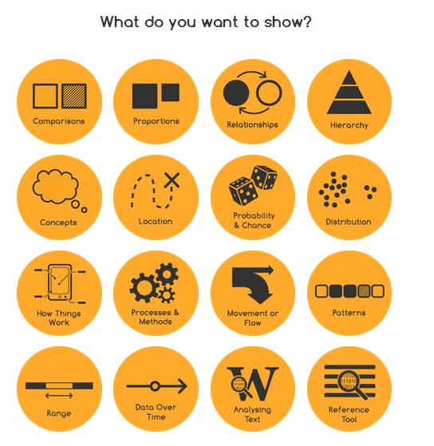

这是一个辅助可视化选择的网站。

网站叫做“The Data Visualisation Catalogue”(数据可视化目录)，网站的作者叫Severino Ribecca，目前是一名从事图形和信息设计的自由职业者。

# 概述
网站的目的是帮助作者本人了解可视化的方法与过程，目前也在不断完善的过程中。目前已经实现了三十多种可视化图形的介绍。对与每一个图形的介绍，都包括了图形的描述、图形的详细剖析、特性与功能、与之相关的图形、以及能够生成此类图形的工具或方法。

除此之外，这个网站还支持根据功能进行查找与选择，下图是根据功能查找的界面，作者定义了十六种不同的功能，包括比较、位置、概念等等，点击进入后，会给出图形的推荐。

# 举个例子
对于散点图(Scatter plot)的介绍，首先给出了散点图的一个样例如下。

然后对散点图进行了描述，比如提到了散点图一般通过笛卡尔坐标系来呈现两个或多个变量。在介绍之后，又通过图示对散点图进行了剖析，如各个维度的含义与作用等，如下图。

除此之外，对于散点图，还介绍了Excel、D3.js、Many Eyes等多种工具或软件都可以生成散点图。

# 注意
这个网站比较适合视觉设计、媒体等从业的朋友们进行参考，里面对于某些图形的介绍与讲述，并不全面。对于想系统了解可视化选择、从事可视化研究的朋友们，可以参考我们分享的关于可视化选择的其它文章。