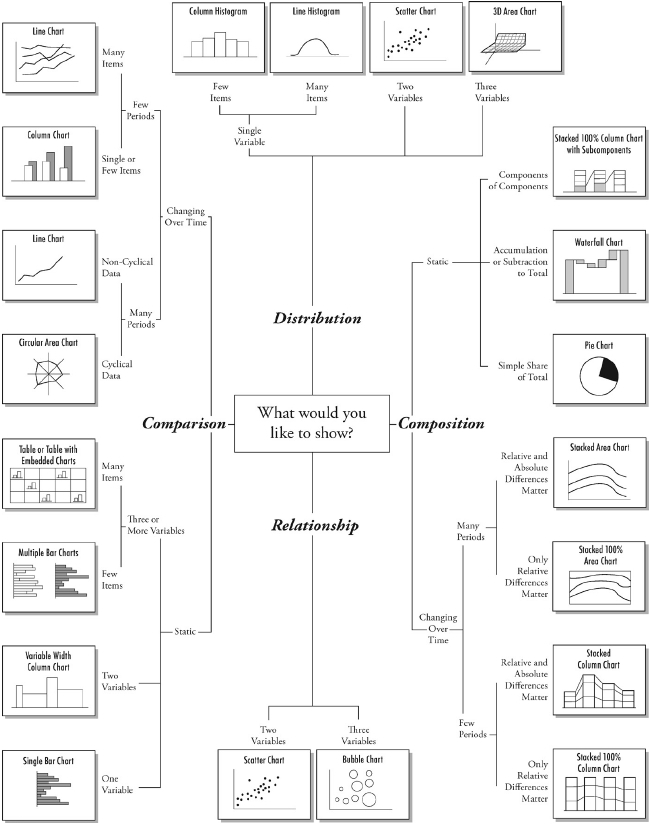
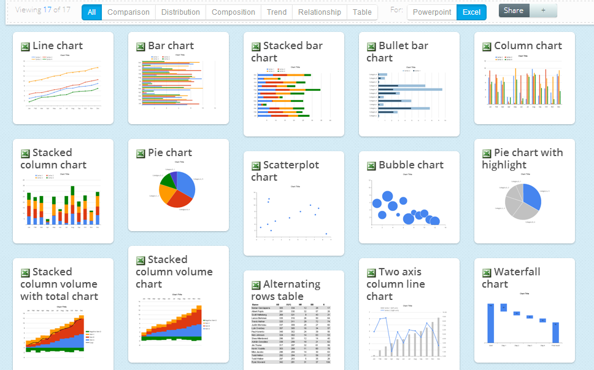

大家是否经常在为这样的事情有所困扰：有了数据，有了目的，但面对众多的可视化形式，不知该选择哪一种进行展现，以达到更好的效果。

今天给大家分享一张图，这张图直观的给出了如何去选择一种可视化形式的方法。
它来自一本书，书名是Andrew Abela博士的《Advanced Presentations by Design》，这本书介绍了如何制作信息图、可视化，并使之富有设计感。书中的第七章“Visual Presentation Elements: Graphics, Charts, Color, Animation, and Fonts”(可视呈现的元素：图形、图表、颜色、动画和字体)给出了这幅图。

首先根据要呈现时的目的，分成四个类别，分别是比较(Comparision)、关系(Relationship)、构成/组成(Composition)、分布(Distribution)。对四个不同的类别的目的，又进行了进一步的划分：

1. 比较
随时间变化：可根据时间的长短、类别的多少，选择折线图、柱状图、雷达图等
不随时间变化：可根据变量的多少、类别的多少，选择柱状图矩阵等

2. 关系
两个变量的关系，可以考虑散点图
三个变量的关系，可以考虑泡泡图
注意：对于更多变量的关系，可以考虑使用散点图的形状、颜色、大小等参数来表示，也可考虑使用平行坐标等多维可视化方式

3. 组成
随时间变化：可根据时间长短、类别多少，选择折线图、堆叠图等
不随时间变化：可根据组成的类型，如所占比例、累计、嵌套组成等，选择饼图、瀑布图、复合堆积图等

4. 分布
单变量：可根据类别的多少，选择直方图、分布图等
两个变量：可选择散点图
多个变量：可选择三维区域图

ExcelPro的图表博客将这张图翻译成了中文，大家可以参考。

有人基于此，专门做了一个网页，帮助大家理解对于可视化图形的选择，根据不同的任务目的，网页中使用Powerpoint与Excel做了相关的演示。

