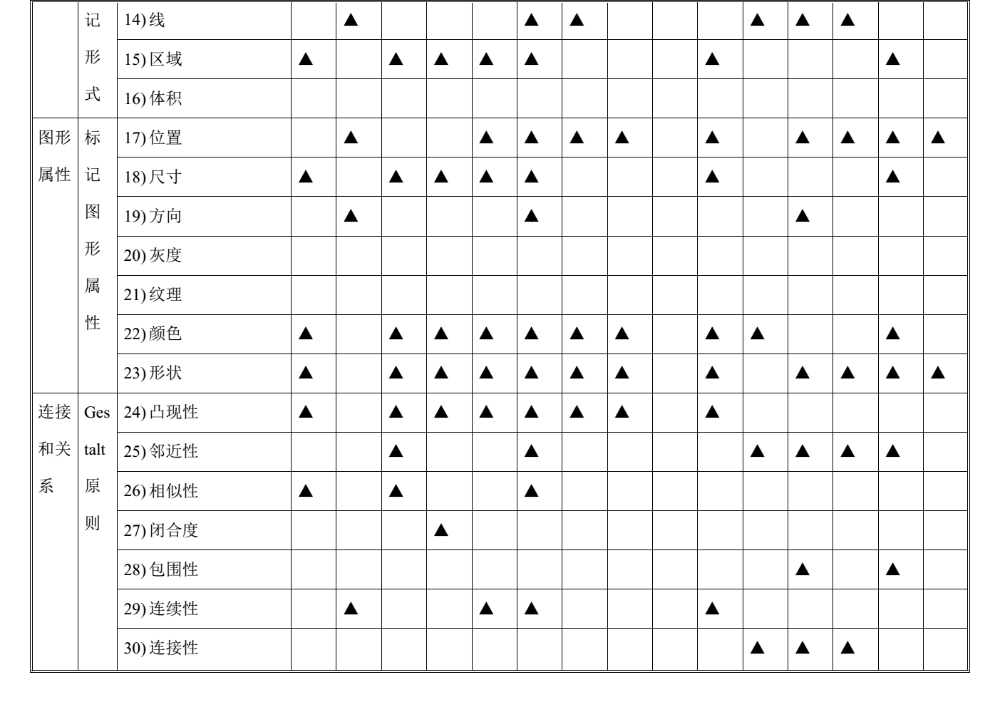

# 从数据类型与分析任务的详细划分

跟大家分享另一种选择可视化的方法，这种方法理论性更加强一些。其核心通过两张表来进行描述。

第一张表是“可视化隐喻的可视结构分析表”，可视化隐喻形式多样，如果能总结出一个统一的结构，这对用户认识可视化隐喻，了解可视化隐喻的类型、特点都有非常大的帮助，也可以帮助用户系统层次的评估所选的可视化隐喻的有效性，而且它对设计新的可视化隐喻的也有很大的指导意义。可视化结构有三个主要部分组成，空间基层、标记和标记的图像属性。这张表将按照空间基层、标记、连接与关系和视网膜属性四个角度分析各种可视化图表的结构。如下：

可视化隐喻的可视结构分析表

以柱状图为例：

* 空间基层上，柱状图将空间分为名词轴与数值轴，然后使用组合技术，故它能够使用（名词，数值）这样的空间位置表达信息，用来完成比较不同项目（名词）的数值大小。
* 柱状图选择面积做为自己的标记。使用柱条这样的面积标记，将数值轴数值映射为一个统一宽度的柱条，柱条的高度与数值成正比。这样，用户就可以直观的比较柱条的高低来比较数值的大小，更容易的感知到数值大小信息。
* 柱状图柱条在空间位置离散、独立，所以没有什么连接和闭合结构，故它不能用来表达数据之间的拓补关系。
* 柱状图的不同柱的可以对应不同颜色，这样就容易将柱条聚类，同一种颜色的柱为一大类。

第二张表是“可视化隐喻与目标任务集对应列表”。针对特定的可视化问题，根据任务分类从中抽取出一系列的任务。这张表分析了柱状图、折线图、饼图等十五种仪表盘的特性，列出其相应的任务序列。如下：

可视化隐喻与目标任务集对应列表

参考文献：
* 滕东兴等, 基于交互式可视组件的分析决策环境研究. 计算机学报, 2011. 34(3): p. 555-565.
* 赵倩,基于可视化分析的交互式仪表盘系统设计与实现. 硕士学位论文,中国科学院,2010.